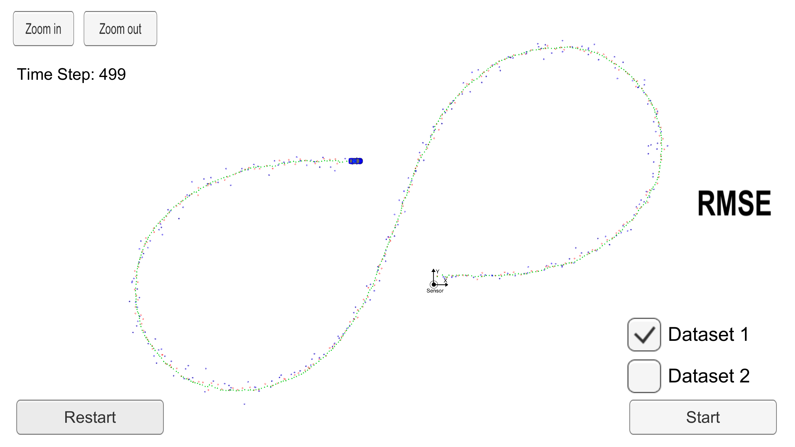
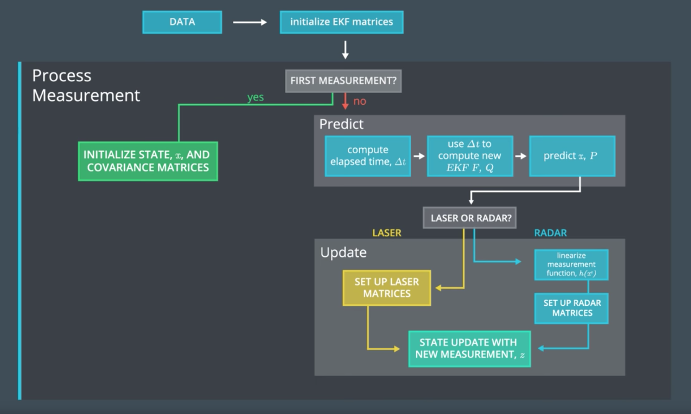

# Object Tracking using Lidar and Radar sensor data - Extended Kalman Filter
Self-Driving Car Engineer Nanodegree Program

## Goal of this project
Uilize a Kalman filter to estimate the state of a moving object of interest with noisy lidar and radar measurements.
The goal is to obatin low RMSE values for the estimated parameters: position in the x and y axis, and velocity in the x and y axis.

## Data
This project involves the Term 2 Simulator from Udacity which can be downloaded [here](https://github.com/udacity/self-driving-car-sim/releases)
Data is read from and to the Simulator by the C++ program. See file `main.cpp`

## Reading data from the Simulator:
This repository includes two files that can be used to set up and install [uWebSocketIO](https://github.com/uWebSockets/uWebSockets) for either Linux or Mac systems. For windows you can use either Docker, VMware, or even [Windows 10 Bash on Ubuntu](https://www.howtogeek.com/249966/how-to-install-and-use-the-linux-bash-shell-on-windows-10/) to install uWebSocketIO. Please see [this concept in the classroom](https://classroom.udacity.com/nanodegrees/nd013/parts/40f38239-66b6-46ec-ae68-03afd8a601c8/modules/0949fca6-b379-42af-a919-ee50aa304e6a/lessons/f758c44c-5e40-4e01-93b5-1a82aa4e044f/concepts/16cf4a78-4fc7-49e1-8621-3450ca938b77) for the required version and installation scripts.

## Run the project
Once the install for uWebSocketIO is complete, the main program can be built and run by doing the following from the project top directory.

    1. mkdir build && cd build
    2. cmake .. && make
    3. ./ExtendedKF

Then open the simulator and click on start.

## Results

### Final RMSE Values:

        rmse_x:  0.0973178
        rmse_y:  0.0854597
        rmse_vx: 0.451267
        rmse_vx: 0.439935

 

## Workflow

 

1. The pedestrian's state is represented by a 2D position and 2D velocity vector: `x --> [Px, Py, Vx, Vy]`

2. Every time we receive a new measurement from either sensor, the process measurement function is triggered

3. At the first iteration we just need to initialize the state and covariance matrices

4. Call the `prediction` and `measurement` update

5. Before the prediction, we need to compute the elapsed time between the current measurement and the previous one, so that we can calculate the new state transition and process covariance matrices.

6. The measurement update step depende on the sensor type:
        
        1. Radar: We need to compute the new Jacobian Hj, use the non-inear measurement function to project the predicted state and then call the measurement update

        2. Lidar: We just need to set up the Extended Kalman Filter with the Laser H and R matrices. Then call the measurement update
